# Hi, I'm Rakesh B

**Cybersecurity Student · Building AI-Driven Defensive Security Tools**

Second-year B.Tech student specializing in Cybersecurity at Dayananda Sagar University, Bengaluru. I work at the intersection of **network security, threat detection, and applied ML**, focusing on making defensive tools more adaptive and easier to understand — not just "it flagged an attack," but *why*.

📫 **rakesh.122605@gmail.com** · 🔗 [github.com/Rakesh-b002](https://github.com/Rakesh-b002)

---

## What I'm Working On

### 🍯 Adaptive IoT Honeypot with ML-Based Anomaly Detection
A Cowrie-based SSH/Telnet honeypot (inspired by the AIIPot paper) that logs attacker sessions to MongoDB and analyzes behavior with two Isolation Forest models — one behavioral, one semantic (sentence-transformer embeddings + PCA) — plus DBSCAN clustering to group attacker sessions by tactic.
- Behavioral feature extraction: 9 features including Shannon entropy, unique-command ratio, and download/execute detection
- Phase 1 (honeypot + logging) and Phase 2 (feature extraction) complete, with a full unit test suite passing
- **Stack:** Python, Cowrie, MongoDB, scikit-learn, Sentence-Transformers

### ⚡ SNN-Based Intrusion Detection System
Exploring Spiking Neural Networks as a lower-power alternative to conventional deep learning for network intrusion detection, trained on the TON_IoT and CIC-IDS2018 datasets.
- **Focus:** energy-efficient inference, IDS, network security

### 🛰️ Azure SOC & SIEM Lab
A hands-on security monitoring environment built in Azure to practice log collection, detection engineering, and incident investigation the way a SOC analyst would.
- **Focus:** Microsoft Sentinel, log analysis, detection tuning

### 🏗️ NirmanAI — Hack2Skill BRICS Innovation Hackathon
An explainable AI decision-support platform for public infrastructure prioritization, built for the hackathon's Digital Public Good challenge. Citizen-reported issues (initially potholes, extensible to broader civic infrastructure) are fused with population density, road-safety data, and public investment plans into an **Infrastructure Priority Score** that gives policymakers a transparent, ranked view of where to act first — rather than another unranked reporting app.

---

## Tech Stack

<table>
<tr>
<td><b>Security</b></td>
<td>

</td>
</tr>
<tr>
<td><b>AI / ML</b></td>
<td>

</td>
</tr>
<tr>
<td><b>Cloud & Infra</b></td>
<td>

</td>
</tr>
<tr>
<td><b>Also Familiar With</b></td>
<td>

</td>
</tr>
</table>

---

## GitHub Stats

  
  

*(Auto-generated daily by a GitHub Action — see setup below. Until the workflow runs once, these will show as broken images.)*

---

## Open to Collaborate

Interested in working with others on cybersecurity × AI/ML projects with real research or real-world potential — reach out if you're building something in that space.
